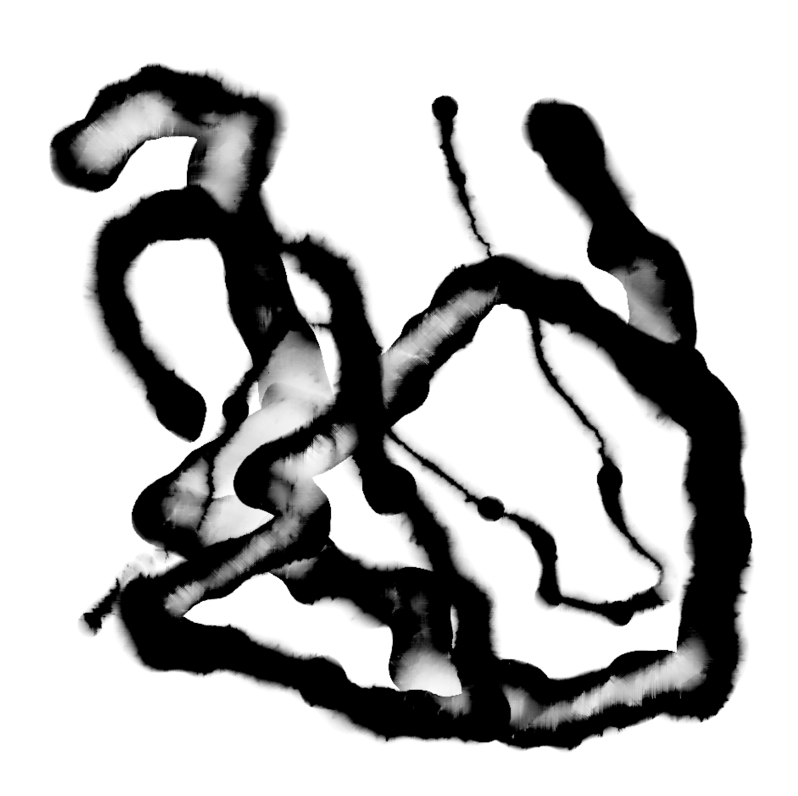

# unity-moxi

Lattice Boltzman Equation base ink simulation called Moxi implemented on Unity.
Compared to the algorithm in the thesis, this implementaion has less parameters and did slightly modified its algorithm aming it to be simple and robust for tuning.

## Compatibility

Tested on Unity 2019.3.0f1, windows10 (RTX 2080 max-q).

## Sources

Moxi thesis - http://visgraph.cse.ust.hk/MoXi/moxi.pdf

About lattice boltzmann equation - https://www.math.nyu.edu/~billbao/report930.pdf

## License
[MIT](LICENSE)
